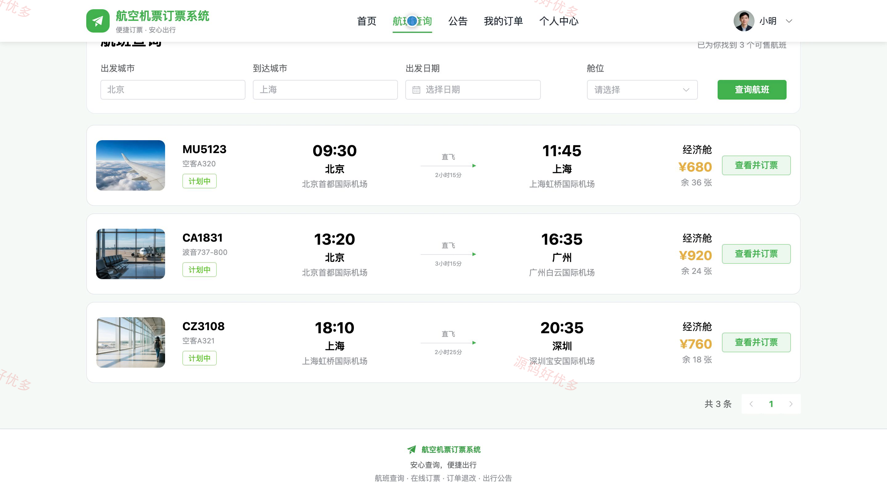
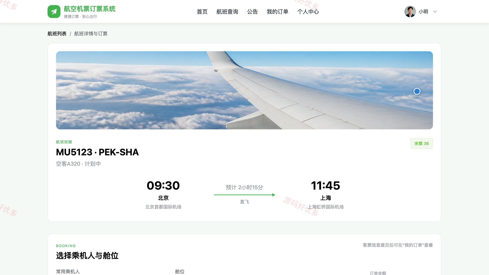
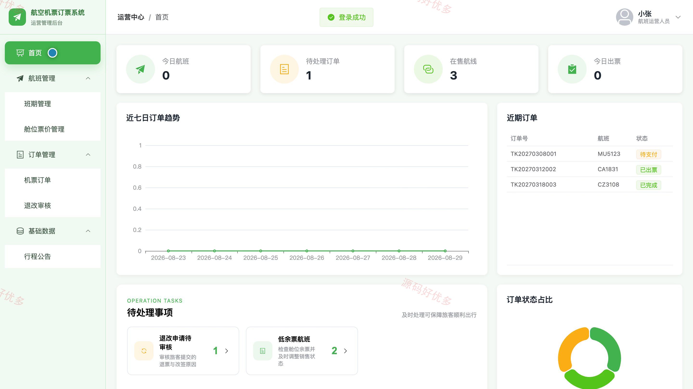
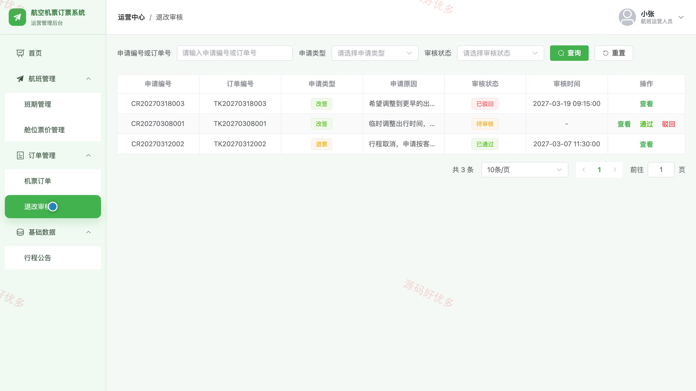
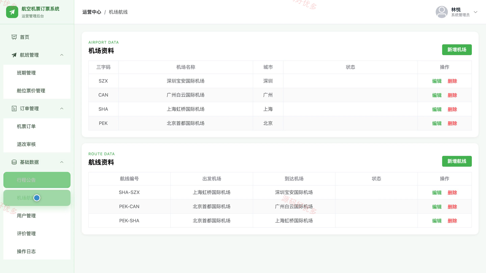
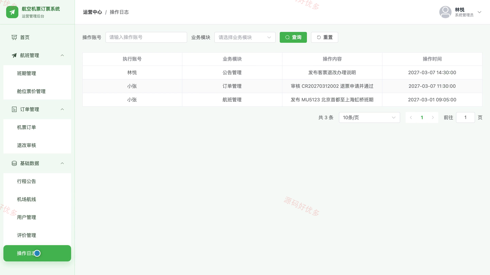

## 源码问题查看主页咨询

### 一、关键词
航空订票、机票预订、航班查询、在线购票、退票改签

### 二、作品包含
源码+数据库+万字设计文档+PPT+全套环境和工具资源+本地部署教程

### 三、项目技术
前端技术： Html、Css、Js、Vue3.4、Element-Plus
后端技术：Java、SpringBoot3.2.0、MyBatis-Plus

### 四、运行环境（以下版本亲测，其他版本兼容性请自行测试）
开发工具：IDEA/eclipse + VSCODE

数据库：MySQL5.7+（共14张表）

数据库管理工具：Navicat10以上版本

环境配置软件： JDK17 + Maven

前端Nodejs：16+

浏览器：谷歌浏览器

### 五、项目介绍
项目编号：bs104A

系统面向旅客用户、航班运营人员和系统管理员，围绕航班查询、乘机人维护、在线订票、订单支付、退改审核与行程公告形成完整机票服务流程，并支持舱位票价、机场航线、用户评价和运营数据的统一管理。

角色：旅客用户、航班运营人员、系统管理员

旅客用户功能：账号注册与登录、航班查询与详情查看、常用乘机人维护、选择舱位在线订票、机票订单支付与查询、退票改签申请、行程服务评价、个人资料与密码维护。

航班运营人员功能：运营数据看板、航班班期管理、舱位票价与余票管理、机票订单处理、退票改签审核、行程公告管理、个人资料维护。

系统管理员功能：运营数据看板、航班班期与票价管理、机票订单与退改管理、机场航线管理、旅客与运营账号管理、行程公告管理、服务评价管理、操作日志查询。

### 六、运行截图

